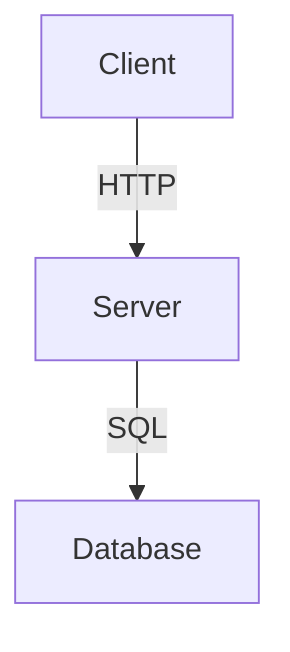

# Product Guidelines

## Prose Style
**Technical / developer-focused:** Use concise, precise imperative mood. Write for developers who are familiar with AI coding assistants. Favor "code-example-first" approach: explain what the code does before why. Avoid fluff; every sentence should add technical value.

> **Key principles:**
> - Use imperative verbs for commands and configurations (`# Run`, `# Configure`, `# Write`).
> - Keep sentences short and dense. Remove hedging words ("typically", "usually", "ideally").
> - Prefer active voice over passive.
> - Inline code formatting for all filenames, commands, and field names.

## Brand Messaging
- **"Measure twice, code once":** Emphasize deliberate, careful development over rapid iteration. Before writing implementation code, ensure the specification and plan are thorough and reviewed. This reduces rework and maintains quality.
- **"Context as code":** Treat project context (product definitions, tech stack, workflow, ACIDs) as first-class managed artifacts alongside source code. Context drives every agent interaction and persists across revisions. Without managed context, AI-assisted development drifts and accumulates drift.

## Visual Identity / Formatting
**Header hierarchy:** Follow a strict heading order. Do not skip levels.

```markdown
# Top-level section (H1)
## Major subsection (H2)
### Minor subsection (H3)
#### Detail (H4)
```

Do not use `H5` or `H6` unless absolutely necessary for deep nesting. All guide files (`product.md`, `product-guidelines.md`, `tech-stack.md`, `workflow.md`) must begin with an `##` H2-level subtitle under their respective H1 title, consistent across the project.

**Mermaid diagrams** (recommended but optional): Use Mermaid for architecture diagrams, flowcharts, and decision trees. Format code blocks as:



**Tables:** Use Markdown tables for tech stacks, dependency graphs, and ACID mappings. Keep column widths consistent and avoid nested tables.

## Documentation Structure
**Index-driven:** The project uses a single `index.md` that references all subsidiary guide files. This index serves as the project context entry point. Each guide file must include a top-level header matching its name and an anchor link in the index.

> **Index pattern** (generated automatically; manually maintained during setup):

```markdown
# Project Context

## Definition
- [Product Definition](./product.md)
- [Product Guidelines](./product-guidelines.md)
- [Tech Stack](./tech-stack.md)
- [Workflow](./workflow.md)

## Workflow
- [Workflow](./workflow.md)
- [Code Style Guides](./code_styleguides/)

## Management
- [Stories Registry](./stories.md)
- [Stories Directory](./stories/)
```

Each guide file must preserve its own header structure while being referenceable from this index.

## Consistency Checklist
- [ ] All H1 titles are unique across the `scrummaster/` directory.
- [ ] Header hierarchy does not skip levels (H1 → H2 → H3).
- [ ] Brand phrases "Measure twice, code once" and "Context as code" appear in appropriate guides.
- [ ] ACID mapping format is consistent with `scrummaster/epics.md` and fossil ticket schema.
- [ ] Mermaid diagrams (where used) validate at `https://mermaid.live`.